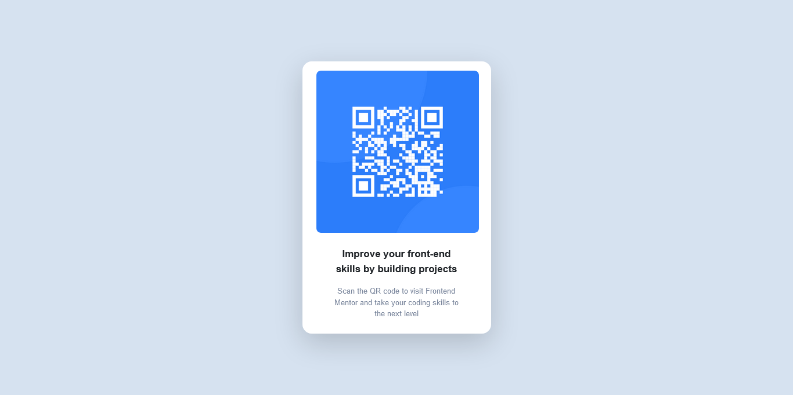
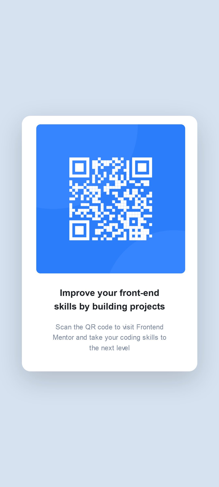

# Frontend Mentor - QR code component solution

This is a solution to the [QR code component challenge on Frontend Mentor](https://www.frontendmentor.io/challenges/qr-code-component-iux_sIO_H). Frontend Mentor challenges help you improve your coding skills by building realistic projects. 

## Table of contents

- [Overview](#overview)
  - [Screenshot](#screenshot)
  - [Links](#links)
- [My process](#my-process)
  - [Built with](#built-with)
  - [What I learned](#what-i-learned)
  - [Continued development](#continued-development)
  - [Useful resources](#useful-resources)
- [Author](#author)
- [Acknowledgments](#acknowledgments)

## Overview

### Screenshot

 - desktop view
 - mobile view

### Links

- Solution URL: [Solution URL here](https://www.frontendmentor.io/challenges/qr-code-component-iux_sIO_H/solutions/)
- Live Site URL: [Live site URL here](https://frontend-mentor-qr-code-p.netlify.app/)

## My process

### Built with

- Semantic HTML5 markup
- CSS custom properties
- Flexbox
- Mobile-first workflow
- [Bootstrap](https://getbootstrap.com/) - For styles

### Useful resources

- [Google](https://www.google.com/) - This is a useful resource it always help me get out when I'm stuck once I search it will always bring out a result for me.
- [Youtube](https://www.youtube.com/) - This is a very useful resource that I hoped every programmer out there stick to it really helps me in most of my projects, even in things I do every day its very useful
- [stack overflow](https://stackoverflow.com/) - This is an amazing resource and I really appreciate the makers its been really helpful when ever I put in a question its either someone as asked that question before so I will get my answer at once or there are people waiting to answer my question and I get my answer immediately.
- [w3schools](https://www.w3schools.com/) - Its a wonderful resource you can use it to learn any program beginner and professional its very helpful.
- [Bootstrap](https://getbootstrap.com/) - I use this for my styling it makes my work beautiful and neat.

## Author

- Website - [Samuel Ejalonibu](https://github.com/SamuelWorld20)
- Frontend Mentor - [@SamuelWorld20](https://www.frontendmentor.io/profile/SamuelWorld20)

## Acknowledgments

I want to use this to appreciate people that as worked on me to be a wonderful developer. Mr Durodola Kehinde who built me from scratch and Aptech computer education for developing my skills. I'm currently a student at Alx here is there link - (https://twitter.com/alx_africa).

